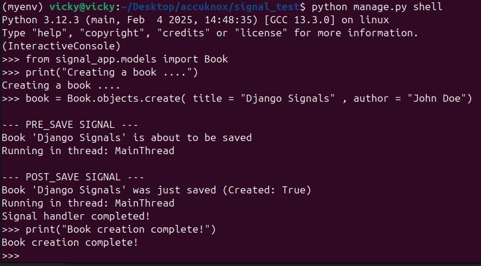
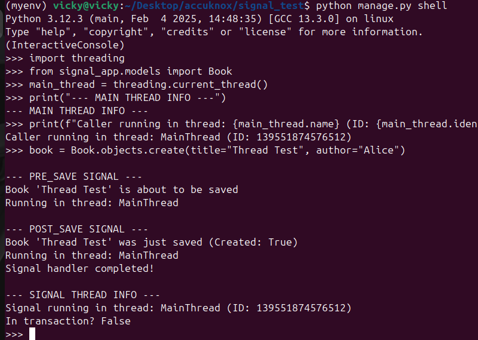
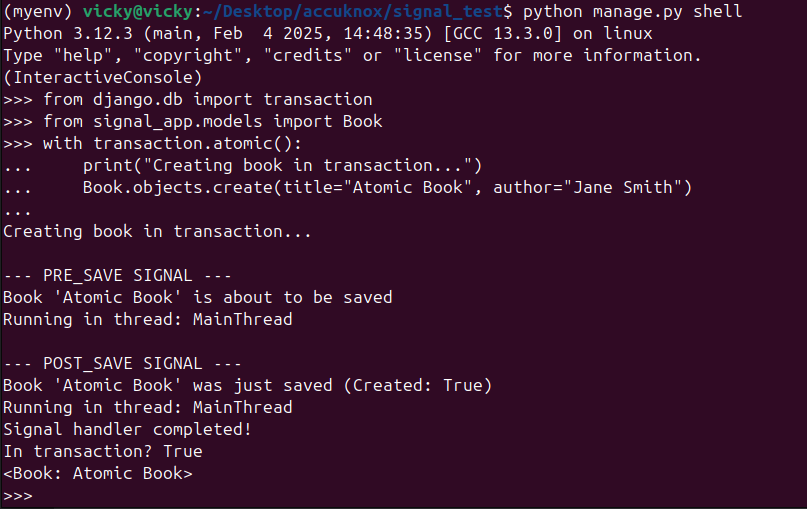
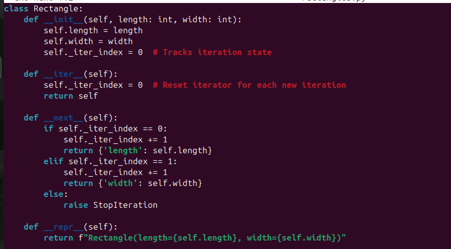

# Python & Django Tasks

This repository contains solutions for two distinct programming tasks:
1. **Django Signals Behavior Analysis**
2. **Custom Rectangle Class Implementation**

---

## Task 1: Django Signals Behavior Analysis

### Overview
This task investigates three key behaviors of Django signals:
1. Synchronous vs. asynchronous execution
2. Thread execution context
3. Database transaction behavior

### Implementation
- Created a Django project (`signal_test`) with a dedicated app (`signal_app`)
- Implemented signal handlers for `pre_save` and `post_save` signals
- Added thread and transaction analysis in signal handlers

### Key Findings
### Key Findings

1. **Signals execute synchronously** (blocking)  
     
   *Diagram showing sequential execution of signal handlers*

2. **Signals run in the same thread** as the caller  
     
   *Visualization comparing thread IDs between caller and signal handler*

3. **Signals respect database transactions**  
     
   *Diagram showing signals within a transaction atomic block*

### How to Test
1. Clone the repository
2. Run migrations:
   ```bash
   python manage.py makemigrations
   python manage.py migrate


## Task 2: Custom Rectangle Class

### Overview
Implemented an iterable Rectangle class that:
1. Requires integer length and width at initialization
2. Can be iterated over to yield dimensions in dictionary format

###Implementation


###Feature
- Type hints enforce integer parameters
-Proper iterator protocol implementation
-Clean string representation
